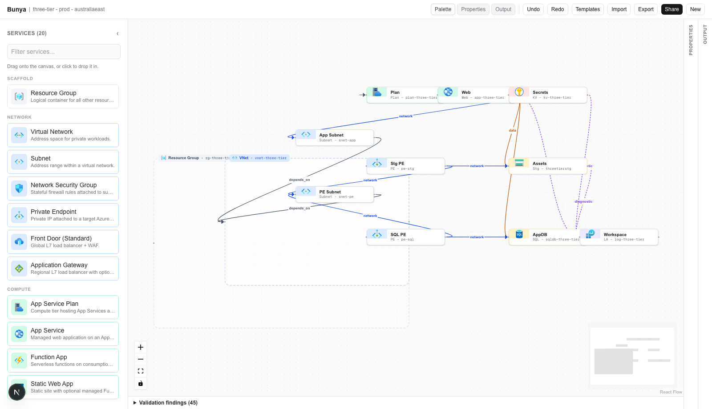
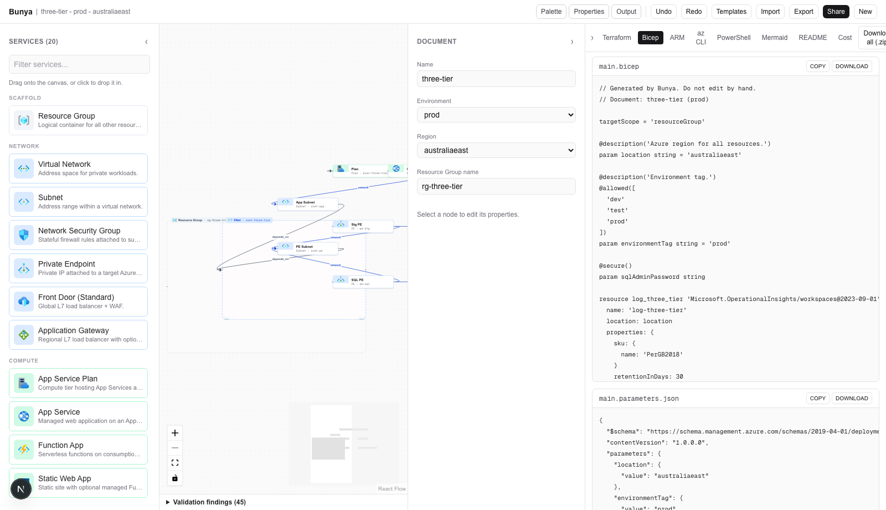
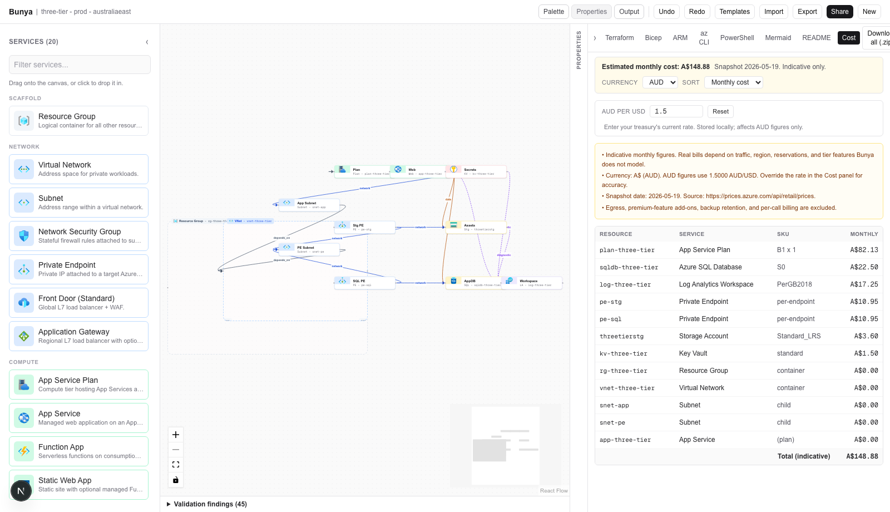
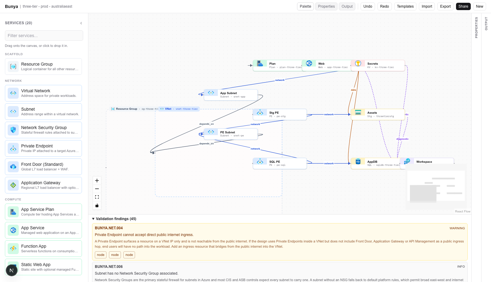
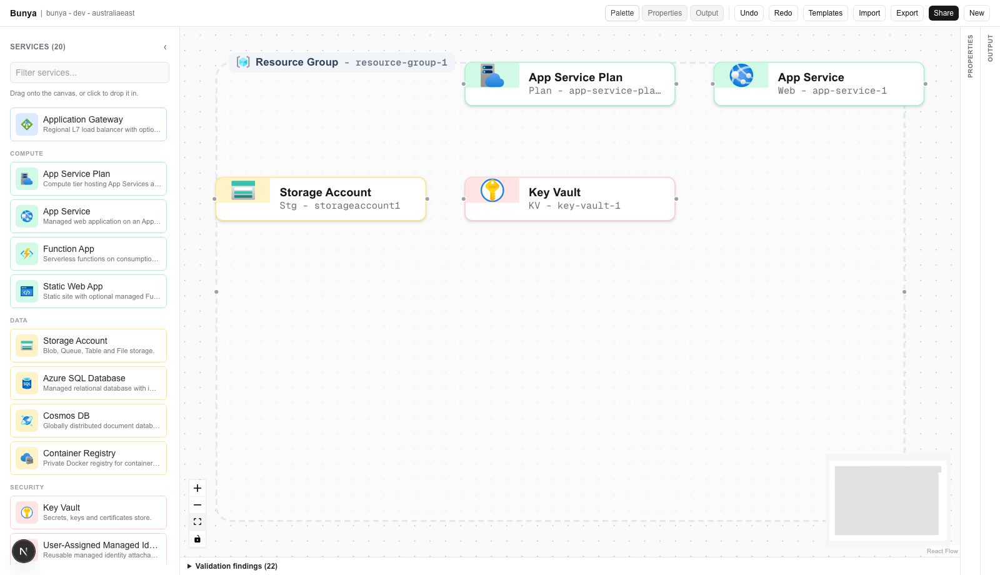

<p align="center">
  
</p>

<h1 align="center">Bunya</h1>

<p align="center">
  <em>Diagram-driven Azure Infrastructure as Code, with a rules engine that knows when the picture is wrong.</em>
</p>

<p align="center">
  
</p>

Bunya turns Azure architecture diagrams into production-shaped Terraform,
Bicep, ARM, az CLI, PowerShell, Mermaid, and an auto-generated README, in one
pass. The diagram is the input. The IaC is the output. And before anything is
emitted, the graph is checked against ~240 cited rules drawn from PSRule,
Checkov, Azure Policy, the Microsoft Cloud Security Benchmark, the Australian
ISM, and the Essential Eight.

[Skip to: How it works](#how-it-works) -
[Generators](#generators) -
[Rules engine](#rules-engine) -
[Local dev](#local-development) -
[Known gaps](#known-gaps)

---

## Why Bunya is not just another diagram tool

There are dozens of tools that draw Azure boxes and arrows. Most of them are
diagram-first: pretty PNGs, awkward export buttons, and IaC output that no
serious engineer would put in front of a `terraform plan`. Bunya inverts that.
The diagram is a UI for the graph, the graph is the source of truth, and the
generators are the thing the project is actually judged on.

What that means in practice:

| Most diagram tools | Bunya |
| --- | --- |
| Boxes and arrows are the artefact | The graph is the artefact, diagram is a view |
| Export-to-Terraform is a half-finished feature | Six generators with snapshot tests |
| Edges are decoration | Edges have semantics: `network`, `identity`, `data`, `depends_on`, `diagnostic` - and they shape the generated resources |
| One Resource Group, hard-coded | Multi-RG architectures with nested containers, parent-aware emitters |
| Free text validation if any | ~240 rules, each citing an authoritative publisher |
| "Looks good" is the gate | Every rule has an autofix or an explainable failure |

The whole point is the IaC. Drop a Resource Group on the canvas, drop an App
Service Plan and a Web App inside it, connect them with a `data` edge to
Storage and an `identity` edge to Key Vault, and click `Terraform`. What comes
out is real, idiomatic HCL with role assignments, diagnostic settings, and
managed-identity wiring. Click `Bicep` and the same graph emits idiomatic
Bicep, not a transliteration. Click `PowerShell` and the same graph emits
splatted, `Set-StrictMode`-aware Az cmdlets that pass `-WhatIf`.

## Built for Australian compliance

The product is opinionated about where data lives and how it talks. Default
region is `australiaeast`. Cross-region edges are flagged. Cosmos DB with
multi-region writes inside an Australia-resident workload raises a finding.
Resource names that don't pass the Azure Naming Tool's regex are caught at
design time, not at `terraform apply`. The Australian Government Information
Security Manual and the ACSC Essential Eight are first-class rule sources, not
afterthoughts.

If you are building for IRAP-aligned hosting, the rules engine is the part of
this tool that earns its keep.

---

## How it works

```
Palette ─┐
         ├─ drag/click ─┐
Templates┘              │
                        ▼
                  ┌───────────┐
                  │   Graph   │ ◄── Zod-validated, undo/redo, share URL
                  └─────┬─────┘
                        │
            ┌───────────┼────────────┐
            ▼           ▼            ▼
    ┌──────────┐ ┌──────────┐ ┌──────────┐
    │ Validate │ │  Render  │ │ Generate │
    │ 240 rules│ │ ReactFlow│ │  6 IaC   │
    └────┬─────┘ └──────────┘ └────┬─────┘
         │                         │
         ▼                         ▼
    Findings panel           Terraform, Bicep,
    with citations           ARM, az CLI,
    + autofix buttons        PowerShell, Mermaid,
                             README + zip download
```

1. **Drag a service from the palette onto the canvas.** Hit-test places the
   node inside the smallest container that accepts it. Resource Groups accept
   anything except other RGs. Virtual Networks accept Subnets.
2. **Drag from a node handle to another node to connect them.** The edge kind
   is inferred from the pair: `App Service -> Storage` is `data`, `App Service
   -> Key Vault` is `identity`, anything `-> Log Analytics` is `diagnostic`.
   Invalid connections are blocked at drag-time with a toast explaining why.
3. **Right panel auto-generates a form** from the selected node's Zod schema.
   Numeric ranges, enum dropdowns, boolean toggles, JSON record editors.
4. **The validation panel runs after every change.** Findings link back to
   nodes and edges; auto-fixable ones get a button.
5. **The output panel emits six IaC formats** plus an auto-README. Copy any
   file, download any file, or hit "Download all" for a zip you can drop into
   a fresh repo and `terraform apply`.

The whole thing is client-side. No backend, no accounts, no telemetry.
Persistence is `localStorage` plus three escape hatches:

- **Share URL** - gzips the graph into the URL fragment. Paste, open, same canvas.
- **Export** - downloads a versioned `.bunya.json` envelope (`{ format, version, exportedAt, generator, document }`). Hand it to a colleague, attach it to a Jira ticket, check it into a repo. It survives schema migrations because it pins `schemaVersion` and runs through `lib/graph/migrate.ts` on load.
- **Import** - via the toolbar button OR by dragging a `.bunya.json` file onto the canvas. Malformed files surface an explanation without clobbering the current graph.

## Generators

Each generator is a pure function `(graph) -> GeneratedFile[]`. Every change
to a generator forces a snapshot diff, so output regressions are visible on
PRs. Implicit resources (Function App without Storage, App Service without
Plan, Private Endpoint without Subnet) are inserted with a comment marker so
the user can promote them to explicit nodes.

| Target | Files emitted | Idiom |
| --- | --- | --- |
| Terraform | `versions.tf`, `main.tf`, `variables.tf`, `outputs.tf` | AzureRM 4.x. Per-resource module-friendly layout. Role assignments for identity edges. Diagnostic settings per `diagnostic` edge. Parent-aware `resource_group_name`. |
| Bicep | `main.bicep`, `main.parameters.json` | `targetScope = 'resourceGroup'`. `@allowed` decorators on enum properties. `@secure()` only when SQL is in the graph. |
| ARM JSON | `azuredeploy.json`, `azuredeploy.parameters.json` | Verbose but valid. Dependency graph derived from edges, not hand-rolled. |
| az CLI | `deploy.sh` | `set -euo pipefail`. `--only-show-errors`. Login check. `SQL_ADMIN_PASSWORD` guard only emitted when SQL is present. |
| PowerShell | `Deploy-Infrastructure.ps1` | `[CmdletBinding(SupportsShouldProcess)]`. Splatting. `Set-StrictMode -Version Latest`. No `Write-Host`. |
| Mermaid | `architecture.mmd` | `flowchart LR` with per-category classDefs and edge-kind labels. |
| README | `README.md` | Inlined Mermaid + deployment commands per format. |
| Cost | `cost-estimate.md` + in-tab table | Indicative monthly estimate per resource with AUD/USD toggle and a **user-editable AUD/USD exchange rate** (persisted to `localStorage`, plug in your treasury's number for accurate AUD). Source: `https://prices.azure.com/api/retail/prices`; refresh via `pnpm prices:refresh`. |

Conditional parameters: when the graph has no SQL Database, no generator
emits a SQL admin password parameter. When the graph has no Virtual Network,
no generator emits networking scaffolding. The output mirrors the graph
exactly.

<p align="center">
  
</p>

<p align="center">
  
</p>

## Rules engine

Bunya checks every graph against ~240 rules from twenty publishers. Every
rule cites a real URL. The running app never makes HTTP calls; rules ship
as committed TypeScript and are refreshed at build time with `pnpm rules:import`.

Sources currently ingested:

- **PSRule for Azure** - 55 rules covering Storage, App Service, SQL, Cosmos,
  Key Vault, ACR, VNet/NSG, App Gateway, Front Door, APIM, Functions, App
  Insights, Log Analytics.
- **Checkov** - 31 CKV_AZURE_* checks.
- **Azure Policy built-ins** - 20 policies translated from `Azure/azure-policy`.
- **Azure Naming Tool** - 22 length/charset rules.
- **Bicep types** - 21 enum/range rules derived from the AzureRM provider schema.
- **Australian Government ISM** - 17 controls including ISM-0974, ISM-1552,
  ISM-1525, ISM-1480, ISM-0405.
- **Essential Eight Maturity Model** - 8 strategy mappings to cloud configuration.
- **Azure Private Link FAQ** - 9 hand-encoded rules for Private Endpoint
  topology, the single richest source for edge rules.
- **Microsoft Learn well-known patterns** - 10 reference-architecture rules.
- **Bunya hand-written graph-rules** - 49 rules under `lib/rules/graph-rules/`
  covering implicit dependencies, identity flow, observability, sovereignty,
  naming, cost, and compliance.

Findings carry a `source.url` you can click. Many carry an `autofixId` you can
apply with one button. The compliance tables in
[`project-docs/rules/COVERAGE.md`](project-docs/rules/COVERAGE.md) regenerate every build.
[`project-docs/rules/GAPS.md`](project-docs/rules/GAPS.md) is honest about what is not
checked: CIS Benchmarks, PCI DSS, HITRUST CSF, runtime policy, cost prediction,
multi-region failover correctness.

<p align="center">
  
</p>

## Containers and hierarchy

Real Azure architectures span multiple Resource Groups, and Virtual Networks
hold Subnets. Bunya's graph models both. Resource Groups and Virtual Networks
render as dashed bounding boxes with a coloured header pill. Drop a Storage
Account inside an RG and it becomes a child node, dragging-bound to its
parent. The generators walk the parent chain when resolving `resource_group_name`
or `virtual_network_name`, so re-parenting in the UI re-points the IaC.

<p align="center">
  
</p>

## Starter templates

Three templates exist; choose one from the toolbar's `Templates` dropdown:

- **Static web app with API** - Static Web App + Function App + Storage +
  Application Insights pipeline.
- **Three-tier web app** - App Service + SQL + Storage behind Private
  Endpoints, with Key Vault and Log Analytics.
- **Event-driven Functions** - Function App + Storage + Cosmos DB with
  managed identity to Key Vault and App Insights to Log Analytics.

## Local development

```bash
pnpm install
pnpm dev          # http://localhost:3000
```

Open the editor. Drag from the left palette. Click `Templates` to load a
preset. The output panel updates live as you edit.

Scripts:

```bash
pnpm typecheck       # tsc --noEmit, strict
pnpm test            # vitest run (63 unit tests, snapshot coverage of every generator)
pnpm e2e             # playwright tests against the dev server
pnpm build           # next build (Turbopack)
pnpm rules:import    # rebuild rule registry + COVERAGE.md + GAPS.md
pnpm rules:verify    # assert every rule has source.url, no duplicates, >=100 total
pnpm rules:coverage  # regenerate coverage docs without re-ingesting
pnpm prices:refresh  # fetch Azure Retail Prices API and stage a snapshot diff
```

## Architecture

```
app/(canvas)/page.tsx               # editor route
components/
  canvas/Canvas.tsx                 # React Flow wrapper
  canvas/ServiceNode.tsx            # custom node, Lucide icon per service
  canvas/ContainerNode.tsx          # bounding-box for Resource Group and VNet
  canvas/Toolbar.tsx                # Undo/Redo, Templates, Share, panel toggles
  canvas/ValidationPanel.tsx        # cited findings + autofix buttons
  catalogue/ServicePalette.tsx      # 20 services in 7 categories, drag + click
  output/OutputTabs.tsx             # seven tabs, copy/download/zip
  properties/PropertiesPanel.tsx    # auto-generated form from Zod schema
lib/
  graph/schema.ts                   # Zod schemas for GraphDocument/Node/Edge
  graph/store.ts                    # Zustand store, undo/redo, reparent
  graph/serialise.ts                # gzip + base64url share URL, localStorage
  catalogue/services.ts             # 20-service catalogue, allowed targets
  catalogue/icons.tsx               # Lucide icon mapping + category theme
  catalogue/templates.ts            # three starter templates
  catalogue/connections.ts          # canConnect() drag-time validator
  generators/                       # six generators + Mermaid + README
  rules/                            # rules engine: schema, runtime, sources
    sources/<publisher>/            # one folder per upstream source
    graph-rules/                    # Bunya's hand-written BUNYA.* rules
  validation/runner.ts              # thin shim over rules/runtime
scripts/
  import-rules/                     # build-time ingestion pipeline
  generate-coverage.ts              # COVERAGE.md + GAPS.md generator
project-docs/
  rules/SOURCES.md                  # 20 sources, classified INGEST/MANUAL/OUT-OF-SCOPE
  rules/COVERAGE.md                 # auto-generated coverage tables
  rules/GAPS.md                     # auto-generated gap report
  screenshots/                      # captured by e2e/screenshots.spec.ts
e2e/                                # Playwright tests
```

## Tech stack

- Next.js 16 (App Router, Turbopack)
- TypeScript, strict mode, no `any`
- React Flow 11 for the canvas
- Zustand for graph state
- Zod for schema and form generation
- Tailwind CSS v4
- Lucide for icons (200+ services worth of Microsoft-aesthetic glyphs)
- Vitest for unit tests, Playwright for end-to-end and visual capture
- `tsx` for the rules-engine build scripts

No backend. No accounts. No database. All client-side.

## Microsoft icon usage

Bunya may display Microsoft or Azure product icons only in the way Microsoft
permits them to be used for architecture diagrams, training materials, or
documentation. See Microsoft's
[Azure architecture icon guidance](https://learn.microsoft.com/en-us/azure/architecture/icons/)
for the current source guidance.

Do:

- Use the icon to illustrate how products can work together.
- In diagrams, include the product name somewhere close to the icon.
- Use the icons as they would appear within Azure.

Don't:

- Crop, flip, or rotate icons.
- Distort or change icon shape in any way.
- Use Microsoft product icons to represent Bunya or any other product or
  service.

## Known gaps

Bunya is honest about scope. The full live list is at
[`project-docs/rules/GAPS.md`](project-docs/rules/GAPS.md). Highlights:

- **staticWebApp**, **logAnalytics**, **virtualNetwork** and **subnet** each
  have fewer than five rules. (`applicationInsights`, `appServicePlan`,
  `networkSecurityGroup`, `userAssignedIdentity` were lifted past 5 in
  [#1](https://github.com/jusso-dev/Bunya/issues/1)
  -[#4](https://github.com/jusso-dev/Bunya/issues/4).)
- CIS Microsoft Azure Foundations Benchmark - commercial, not redistributable.
- PCI DSS - commercial standard, out of project licence scope.
- HITRUST CSF - commercial, out of scope for Australian-government workloads.
- runtime policy enforcement (drift detection at runtime)
- AWS support, GCP support (intentionally out of scope - Azure only)

## The bunya pine

Bunya is named after the bunya pine, *Araucaria bidwillii*, a tall conifer
native to south-east Queensland and parts of northern New South Wales. The
tree has a distinctive architectural silhouette: a straight central trunk with
tiered, geometric branches stepping out at regular intervals. It looks like a
system diagram already.

The bunya is also significant in Aboriginal culture. Every few years the trees
produce enormous cones full of edible nuts, and historically this triggered
large gatherings of nations from across the region. People travelled long
distances to meet, trade, settle disputes, and share knowledge before
dispersing again. That is the metaphor for what this tool does: it gathers
disparate Azure services into a shared structure, makes the relationships
between them explicit, and then disperses the result into the formats
different teams actually use.

## Contributing

Pull requests welcome. The bar:

- `pnpm typecheck` clean
- `pnpm test` green (add tests for new generators or rules)
- New rules must cite a source URL (verify.ts will block PRs that don't)
- Generator changes get snapshot diffs reviewed
- Australian spelling in user-facing copy

## Licence

MIT. See [`LICENSE`](LICENSE).
